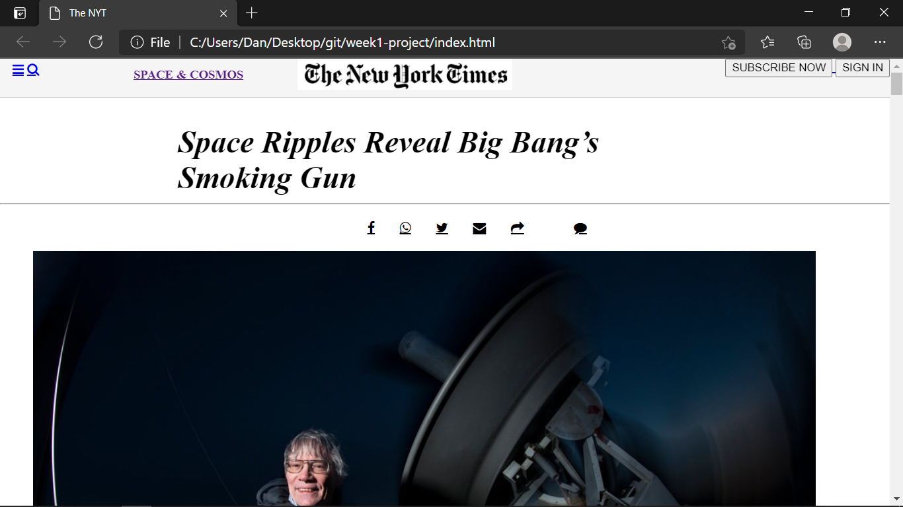

README.md                    

The requirements of this project consists of making a clone of a New York Times article page. Applying some concepts of:

- Embedding images
- Floats and positioning
- The box model


New York Times article page




Additional description about the project and its features.

Built With  Html Css Technologies


👤 Author1

- GitHub:[@danmainah](https://github.com/danmainah)
- Twitter: [@dan_mainah](https://twitter.com/dan_mainah)
- Linkedin:[@danielmaina](www.linkedin.com/in/daniel-maina-315a38191)
 


## Live Link
Here is the live link
[link](https://danmainah.github.io/week1-project/)


## Getting Started

**This is an example of how you may give instructions on setting up your project locally.**
**Modify this file to match your project, remove sections that don't apply. For example: delete the testing section if the currect project doesn't require testing.**


To get a local copy up and running follow these simple example steps.
- Clone this repository with git clone``` https://github.com/danmainah/week1-project``` using your terminal or command line.
- Change to the project directory by entering : <br>
```cd NYTproject``` in the terminal .

## 🤝 Contributing

Contributions, issues, and feature requests are welcome!

Feel free to check the issues page.

Show your support Give a ⭐️ if you like this project!

## Show your support

Give a ⭐️ if you like this project!


## Acknowledgments

- Hat tip to anyone whose code was used
- Inspiration
- etc

Acknowledgments Hat tip to anyone whose code was used Inspiration etc

## 📝 License

This project is [MIT](lic.url) licensed.
